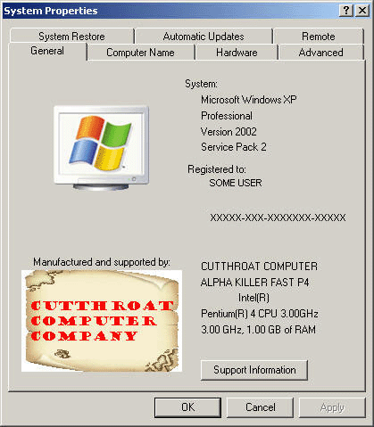



## System Properties Logo Changer

### Description

UPDATED - NOW SAVES ORIGINAL OEM's- Just a way to customize your computer and add your logo and text to the system properties when you right click 'My Computer' and got to the 'Properties' menu. Also shows how to shrink and save a picture and a few other useful functions. I use this when I build a computer to customize it and the customer always has my contact info... REMEMBER, the source picture should be larger than 180w x 120h... It has an 'RESET' button so you can start over from scratch easily. IT NOW FLIPS A REGISTRY KEY AND SAVES YOUR ORIGINAL OEM FILES IF THEY EXIST ON FIRST LAUNCH - PRESS RESET TO RESTORE TO FACTORY.
 
### More Info
 
Picture, text

Source picture should be &gt;180w by &gt;120h, text boxes are limited to 20 char top section and 30 char bottom section.

Sets a logo picture and text in the System Properties tab.

None known

             |
---                |---
**Submitted On**   |2007-07-21 13:31:42
**By**             |[M1K3](https://github.com/Planet-Source-Code/PSCIndex/blob/master/ByAuthor/m1k3.md)
**Level**          |Intermediate
**User Rating**    |5.0 (10 globes from 2 users)
**Compatibility**  |VB 5\.0, VB 6\.0
**Category**       |[Complete Applications](https://github.com/Planet-Source-Code/PSCIndex/blob/master/ByCategory/complete-applications__1-27.md)
**World**          |[Visual Basic](https://github.com/Planet-Source-Code/PSCIndex/blob/master/ByWorld/visual-basic.md)
**Archive File**   |[System\_Pro2076537212007\.zip](https://github.com/Planet-Source-Code/m1k3-system-properties-logo-changer__1-69012/archive/master.zip)

